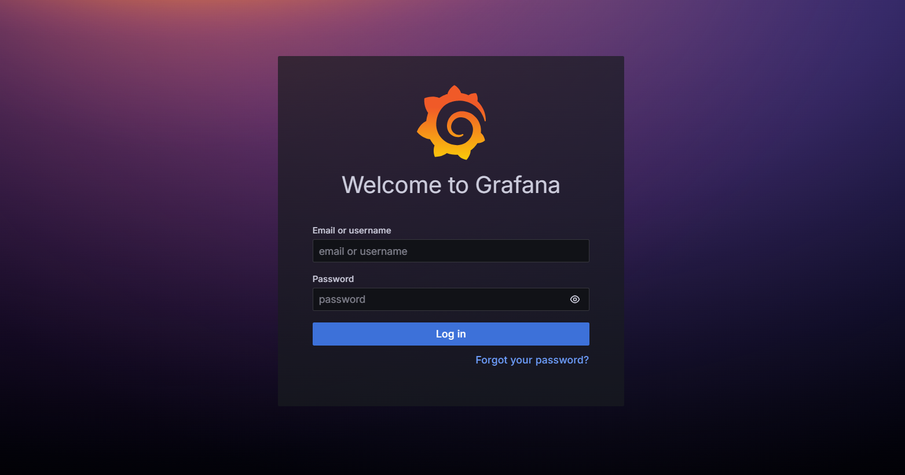
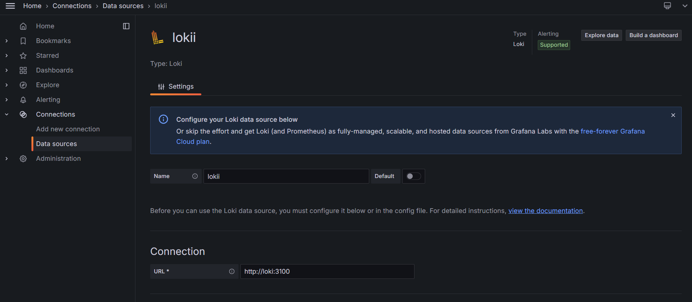
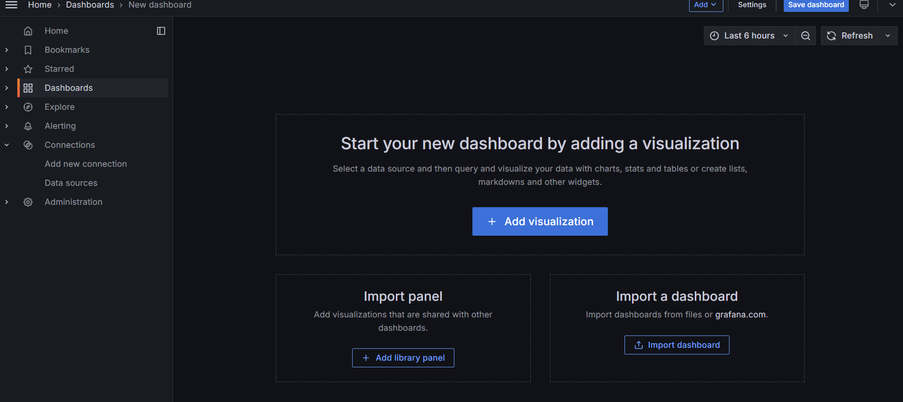
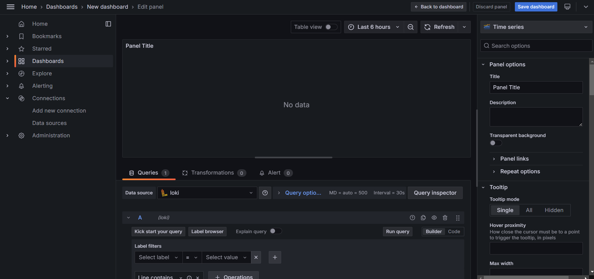
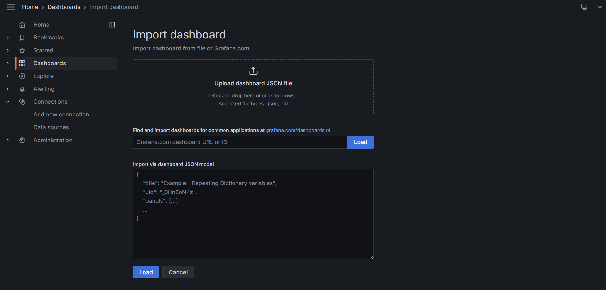
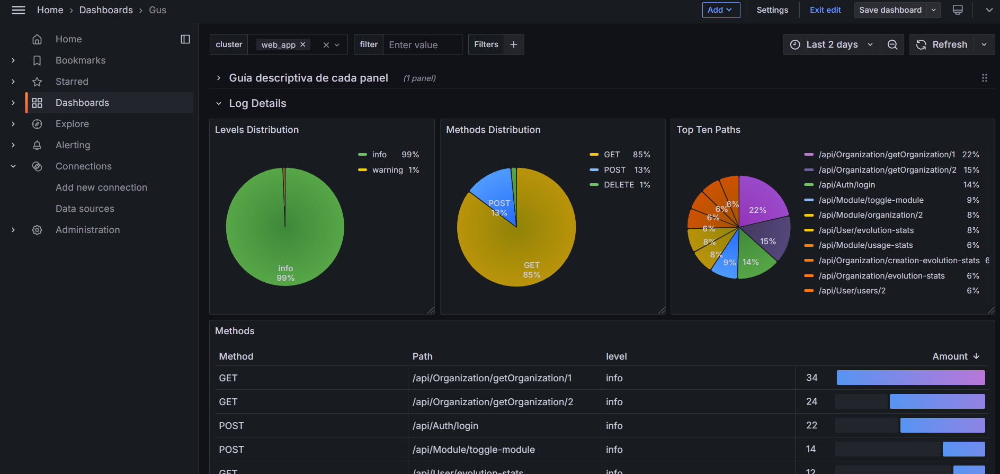

## Implementación de Logs en la Aplicación con Serilog, Loki y Grafana

Este documento detalla el proceso de configuración de logs en nuestra aplicación utilizando Serilog para el registro de logs, Loki como servidor centralizado de logs y Grafana para la visualización de los mismos, todo orquestado mediante Docker.

### 1. Configuración de Serilog

Para habilitar la visualización de logs tanto en la consola como en el servicio de Grafana, seguiremos los siguientes pasos:

#### 1.1 Instalación de Paquetes Necesarios

Instala los paquetes requeridos mediante NuGet:

- **Serilog.AspNetCore** (versión 8.0.3)
- **Serilog.Sinks.Grafana.Loki** (versión 8.3.0)

Además del paquete principal de Serilog, los *Sinks* permiten almacenar los logs en diferentes destinos. En este caso, configuraremos un *Sink* para la consola y otro para enviarlos a Loki, que se encargará de formatear y transmitir los datos a Grafana.

[Documentación Serilog](https://github.com/serilog/serilog/wiki/Getting-Started)  
[Sinks Grafana Loki](https://github.com/serilog-contrib/serilog-sinks-grafana-loki)
#### 1.2 Configuración en `Program.cs`

Añade la configuración de Serilog en el archivo `Program.cs` de tu aplicación:

```c#
builder.Host.UseSerilog((context, loggerConfig) => loggerConfig.ReadFrom.Configuration(context.Configuration));
```

#### 1.3 Configuración en `appsettings.Development.json`

Reemplaza la configuración por defecto de Microsoft con la de Serilog en el archivo `appsettings.Development.json`:

```json
"Serilog": {
  "Using": [ "Serilog.Sinks.Console", "Serilog.Sinks.Grafana.Loki" ],
  "MinimumLevel": "Information",
  "WriteTo": [
    { "Name": "Console" },
    
    {
      "Name": "GrafanaLoki",
      "Args": {
        "uri": "http://localhost:3100",
        "labels": [
          {
            "key": "app",
            "value": "web_app"
          }
        ],
        "propertiesAsLabels": [
          "app"
        ]
      }
    }
  ],
  "Enrich": [ "FromLogContext", "WithMachineName", "WithThreadId" ],
 
}

```

#### Descripción de la Configuración:

- **Console**: Configuración sencilla para la salida de logs en la consola.
- **GrafanaLoki**:
  - `uri`: URL de nuestro servidor centralizado de Loki.
  - `labels`: Etiquetas que permiten identificar y filtrar los logs en Grafana.

---

### 2. Configuración de Loki y Grafana

[Documentación Grafana loki](https://grafana.com/docs/loki/latest/?pg=oss-loki&plcmt=quick-links)

#### 2.1 Configuración de Loki

Loki actuará como nuestro servidor centralizado de logs, formateando y enviando los logs a Grafana.

- **Creación de Red Docker**: Crea una red para los contenedores de Loki y Grafana.
- **Descarga de la Imagen de Loki**: Utiliza la imagen disponible en Docker Hub.
- **Configuración Adicional**: Configura Loki mediante el archivo `loki-config.yml`. Puedes encontrar ejemplos de configuraciones [aquí](https://grafana.com/docs/loki/latest/configure/examples/configuration-examples/).
  
```yml

# You can enable authentication to prevent unauthorized access to your logs
auth_enabled: false

server:
  # This is the port where Loki will receive logs from Docker (or Promtail)
  http_listen_port: 3100
  # This is the port where Loki will expose its API
  grpc_listen_port: 9096

common:
  instance_addr: 127.0.0.1
  path_prefix: /tmp/loki
  storage:
    filesystem:
      chunks_directory: /tmp/loki/chunks
      rules_directory: /tmp/loki/rules
  replication_factor: 1
  ring:
    kvstore:
      store: inmemory

query_range:
  results_cache:
    cache:
      embedded_cache:
        enabled: true
        max_size_mb: 100

schema_config:
  configs:
    - from: 2020-10-24
      store: tsdb
      object_store: filesystem
      schema: v13
      index:
        prefix: index_
        period: 24h

ruler:
  alertmanager_url: http://localhost:9093


```

#### 2.2 Configuración de Grafana

Grafana consumirá los datos de Loki para la visualización de logs.

- **Descarga de la Imagen de Grafana**: Utiliza la imagen disponible en Docker Hub.
- **Configuración de Puertos y Dependencias**: Asegúrate de que Grafana dependa de Loki y configura los puertos adecuadamente.

---

### 3. Configuración de Docker Compose

Para gestionar nuestra red de contenedores, crearemos un archivo `docker-compose.yml` con la siguiente configuración:

```yaml
services:
  loki:
    image: grafana/loki:latest
    container_name: loki
    volumes:
      - ./loki-config.yml:/etc/loki/loki-config.yml
    ports:
      - "3100:3100" # Expone Loki para uso externo
    networks:
      - loki-network
    restart: unless-stopped
    command: -config.file=/etc/loki/loki-config.yml
    healthcheck:
      test: ["CMD", "wget", "-q", "--tries=1", "-O-", "http://localhost:3100/ready"]
      interval: 5s       # Verifica la salud cada 5 segundos
      timeout: 3s        # Tiempo de espera por respuesta
      retries: 5         # Reintentos antes de marcar como no saludable
      start_period: 15s  # Tiempo de gracia para que el servicio inicie

  grafana:
    image: grafana/grafana:latest
    container_name: grafana
    ports:
      - "3000:3000" # Expone Grafana para acceso externo
    networks:
      - loki-network
    depends_on:
      loki:
        condition: service_healthy
    restart: unless-stopped

networks:
  loki-network:
    driver: bridge # Configuración explícita para claridad

```

---

### 4. Levantar el Servicio Loki-Grafana

El servicio Loki-Grafana se ejecutará como una aplicación externa a nuestra aplicación principal (GUS). Los archivos de configuración se encuentran en la carpeta `documentación/loki-grafana`.

#### 4.1 Iniciar los Contenedores

Navega hasta la carpeta que contiene el archivo `docker-compose.yml` y ejecuta el siguiente comando:

```bash
docker compose up -d
```

#### 4.2 Acceso a la Interfaz de Grafana

Una vez que los contenedores estén en funcionamiento, puedes acceder a la interfaz de Grafana en la siguiente URL:

```
http://localhost:3000/
```


**Nota**: Si despliegas los servicios en la nube, reemplaza `localhost` con tu dominio correspondiente.

---


### Grafana
 
#### Paso 1: Iniciar sesión en Grafana 
 
Abre tu navegador web y dirígete a la URL de acceso a la de instancia de Grafana (http://localhost:3000) 

Se mostrará una pantalla de inicio de sesión en la cual se introducen las credenciales de acceso, que por defecto son : 



-Usuario: admin 

-Contraseña: admin 

Si es la primera vez que se accede, se pide cambiar la contraseña si se desea o en otro caso saltar el paso y acceder directamente a la interfaz de grafana. 

 

#### Paso 2: Configuración del Datasource Loki 

 
Una vez iniciada la sesión, en el panel lateral izquierdo , selecciona “Connection” --> “Add new connection” y busca y selecciona Loki como la fuente de datos. 

El siguiente paso es pulsar en el botón de la parte superior derecha “Add new data source”, donde se abre un menu en el que se debe establecer la url del servidor de Loki  (http://loki:3100).  En caso de tener configurado un puerto diferente, simplemente modifica la url indicando el puerto. 



A continuación hay otra serie de configuraciones opcionales en el caso de que se desee establecer autenticación, configuraciones TLS, headers ,cookies,  y alertas entre otras. 

Para el caso, después de ingresar la url de conexión, basta con hacer clik en “Save & Test” y si todo ha ido bien, se informa de que la conexión es correcta y en  caso contratrio, aparece un mensaje con el tipo de error. 

 

 

## Paso 3: Crear un Dashboard en Grafana 

 

Con la conexión establecida, el siguiente paso es acceder a la sección de “Dashboards” para crear una nueva visualización o importar uno existente. 

 
Desde el menú lateral izquierdo, selecciona “Dashboard.” 

A continución pulsa en el bton “New” en la esquina superior derecha. Se abre un desplegable con varias opciones y se selecciona “New dashboard”.  

Una vez dentro, existen tres opciones para iniciar un nuevo dashboard: 


-Añadir visualización 

-Importar panel (visualizaciones compartidas con otros dashboards) 

-Importar dashboard 

 

Si se elige la primera opción, se pide seleccionar la fuente de datos entra las que se tienen configuradas y acto seguido se abre el panel para empezar a configurar un dashboard propio, creando consultas y eligiendo entre diferentes tipos de gráficos. Una vez configurado, se guarda haciendo click en “Save dashboard” 

 

Las otras opciones se refieren a importar o bien paneles o bien un dashboard completo. 

La opción de importar un dashboard permite hacerlo o bien indicando la url o el id del dahboard existente en la url https://grafana.com/grafana/dashboards/ , o bien importando el archivo json directamente si se dispone de el.  

Para esta última opción, se deja un fichero con un dashboard ya configurado a modo de ejemplo . 


## Paso 4: Crear querys

Para crear los gráficos con los datos que tenemos podemos construir las querys que filtrarán los datos a través de la interfaz gráfica que nos ofrece grafana o crearlas nosotras mismos.

Documentación para crear las queries:  
https://grafana.com/docs/loki/latest/query/log_queries/#regular-expression

## Consideraciones Finales

1. **Comunicación entre Contenedores**: Dentro de la red de Docker, los servicios se reconocen por el nombre del servicio definido en `docker-compose.yml`. Por ejemplo, Grafana puede comunicarse con Loki utilizando la URL `http://loki:3100/`.
2. **Persistencia de Datos**: Asegúrate de que los volúmenes de Docker estén correctamente configurados para persistir los datos de Loki.  
   
 Siguiendo estos pasos, habrás configurado Grafana con Loki como datasource para visualizar los logs generados por tu aplicación .NET. Puedes personalizar los dashboards según lo necesites para tener una visibilidad más detallada de los eventos registrados por tu aplicación. 

Si encuentras algún problema, verifica las configuraciones de red, las credenciales de acceso y asegúrate de que los puertos necesarios estén abiertos en tu firewall. 
